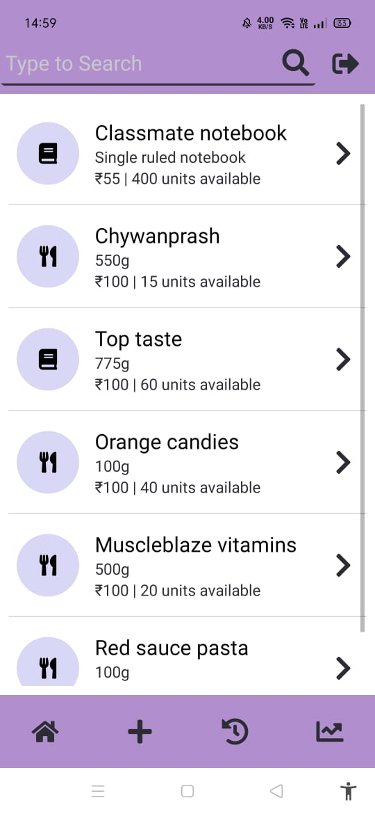
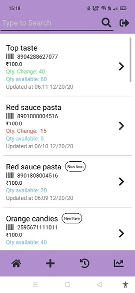
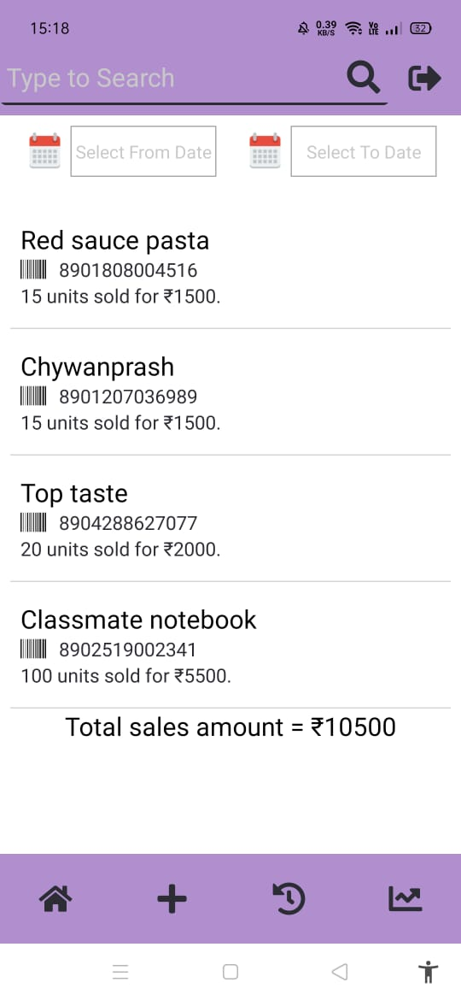

# Client Side app for InventoManage

Inventory Management client app made with React Native

## Features

1. Perform CRUD on the inventory items.
2. Integrated barcode scanner.
3. Display of items update history.
4. Display of sales records (based on time range).
5. User login

## Sneak Peek into the app

